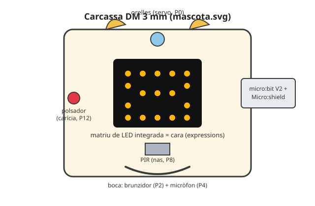

# 🐣 Projecte T1 · La mascota reactiva

> **Per a qui és?** Per a **cada alumne**, individualment, durant el 1r trimestre. És el dossier del primer robot del curs: peces, muntatge, cablatge, codi mínim i rúbrica. Els reptes de SA2 i SA3 hi van sumant capacitats; aquí es veu el conjunt.

**Durada:** 1r trimestre (SA2-SA3) · **Maquinari:** micro:bit V2 + Micro:shield, matriu de LED integrada, altaveu integrat, acceleròmetre integrat, sensor de llum integrat; Kit Keyestudio 1 (LED, polsador, brunzidor), Kit 2 (sensor de llum, PIR), Kit 3 (sensor de so, DHT11), micro servo; caixa de DM 3 mm

## El robot

La mascota és una capsa de fusta DM amb cara de criatura: la **matriu de 25 LED** de la micro:bit fa d'ulls/cara (expressions), un **micro servo** mou unes **orelles** (o una cua) enganxades a la tapa, i el **PIR** i el **sensor de so** miren cap enfora per una **boca somrient tallada al làser**. Per fora sembla un joguet; per dins hi ha la mateixa micro:bit + Micro:shield que ja es fa servir a classe, amb els sensors del Kit connectats pels seus connectors *block*.



Què fa: **expressa emocions** amb la matriu LED i el so —canvia d'expressió i fa melodies d'estat— (treballat a **SA2**) i **reacciona a l'entorn** amb com a mínim **2 comportaments sensor→resposta** —algú s'hi acosta, li fan una carícia, es fa fosc, hi ha soroll o la sacsegen (acceleròmetre)— (treballat a **SA3**). El producte és **individual**: cada alumne li tria un nom i un caràcter, i la mascota reacciona **de manera coherent** amb aquest caràcter.

## Llista de peces

| Peça | Origen | Quantitat |
|---|---|---|
| Plaques de DM 3 mm (caixa) | Plantilla `mascota.svg`, tall làser | 1 planxa (6 peces) |
| Escaires d'angle | `escaire_caixa.scad`, impressió 3D | 8 |
| micro:bit V2 + Micro:shield | Dotació individual | 1 |
| Micro servo (orelles/cua) | Kit 2 | 1 |
| LED / LED RGB | Kit 1 | 1 |
| Brunzidor | Kit 1 | 1 |
| Sensor PIR | Kit 2 | 1 |
| Sensor de so (micròfon) | Kit 3 | 1 |
| Sensor de temperatura i humitat DHT11 *(extra opcional)* | Kit 3 | 1 |
| Polsador | Kit 1 | 1 |
| Cargols M3 x16 | Material del centre | ~16 |

<!-- web:only-github -->
Plantilla de tall làser: [`../../Recursos/plantilles_laser/mascota.svg`](../../Recursos/plantilles_laser/mascota.svg).
Peça impresa en 3D: [`../../Recursos/peces_3d/escaire_caixa.scad`](../../Recursos/peces_3d/escaire_caixa.scad).
<!-- /web:only-github -->

## Fabricació i personalització

La plantilla `mascota.svg` és **fixa** (línies negres de tall i forats de muntatge): ningú la toca. El que cada alumne personalitza és **NOMÉS la zona vermella**, sobre una **còpia pròpia** del fitxer: el dibuix de la boca/cara del frontal (gravat) i el contorn de les **orelles** (etiquetades «ORELLES — encaixen a la tapa»). Qui vulgui una forma pròpia pot redibuixar el contorn negre de l'orella sempre que **mantingui la pestanya de 10 mm** que encaixa a la ranura de la tapa.

Flux (detall del calendari a [`00_Fil_conductor_construccions.md`](00_Fil_conductor_construccions.md)):
1. Cada alumne fa una **còpia** de `mascota.svg` amb el seu nom.
2. Edita **només les línies vermelles** (xTool Creative Space o Inkscape).
3. El docent **valida** el disseny i l'agrupa per **nesting** amb el d'altres 1-2 companys.
4. El lot entra a la **cua de tall** uns dies abans de la sessió de muntatge (SA2·S4); el docent la talla fora d'horari lectiu.

## Muntatge

1. Munta la **base** i els **quatre laterals** de la caixa amb 6 dels 8 escaires impresos, sense encolar encara (els 2 restants es reserven per a la tapa, al pas 5).
2. Fixa la **micro:bit + Micro:shield** a la base, amb el port USB accessible per una obertura lateral.
3. Munta el **servo** a la tapa (base de les orelles/cua) i el **PIR** mirant cap enfora pel forat frontal.
4. Munta el **brunzidor**, el **sensor de so** i el **polsador** darrere la **boca somrient** (el forat tallat fa de sortida de so i d'entrada de senyal).
5. Cablatge complet segons la taula de baix; comprova totes les connexions **abans** de tancar la caixa. Encaixa les orelles/cua i tanca la **tapa superior** amb els 2 escaires restants, deixant-la desmuntable (sense encolar) per si cal repassar el cablatge.
6. Prova d'encesa: comprova que la matriu LED mostra la cara i que el servo es mou abans de donar la mascota per acabada.

> ⚠️ **El servo i el sensor de so comparteixen alimentació externa si cal:** un servo pot demanar més corrent del que el Micro:shield subministra només des de l'USB. Si es mou de manera intermitent o reinicia la placa, connecta l'alimentació externa del Micro:shield (portapiles) abans de seguir depurant.

## Cablatge (pins del Micro:shield)

| Component | Pin | Notes |
|---|---|---|
| Micro servo (orelles/cua) | P0 | PWM; angle amb `pins.P0.write_analog()` o llibreria de servo. |
| LED / LED RGB (indicador d'humor) | P1 | Sortida digital/PWM. |
| Brunzidor | P2 | `music.pitch()` o PWM propi. |
| Sensor PIR | P8 | Digital; necessita 30-60 s d'estabilització en engegar. |
| Polsador (carícia) | P12 | Digital, amb *pull-up* i antirebot per programari. |
| Sensor de so (micròfon) | P4 (analògic; ADC vàlid: P0/P1/P2/P3/P4/P10) | Llindar de so a calibrar; el micròfon **integrat** de la micro:bit V2 (`microphone.sound_level()`) és una alternativa vàlida si no s'usa el del Kit 3. |
| DHT11 *(extra)* | P13 | Bus digital 1-Wire (llibreria pròpia de MicroPython per a DHT). |

**Sensors ja integrats a la micro:bit V2** (sense cablejar res): matriu de LED (`display`), altaveu (`audio`/`music`), acceleròmetre (`accelerometer`), sensor de llum (`display.read_light_level()`) i botons A/B.

> 🔑 **Per al docent:** implementació completa de referència al [solucionari del trimestre](../Solucionari/Solucionari_T1_SA1-SA3.md).

## Simular la mascota abans de muntar-la

El simulador de python.microbit.org reprodueix la **matriu de LED, els botons A/B i l'acceleròmetre** amb fidelitat; per als sensors del Kit (PIR, so, DHT11) cal **substituir-los per una entrada simulada** (per exemple, `button_a.is_pressed()` fent de PIR mentre no hi hagi maquinari) i recalibrar els llindars reals un cop la mascota estigui cablejada de debò. Vegeu les limitacions generals del simulador a [`00_Entorns_de_treball.md`](00_Entorns_de_treball.md) §2.

## 🧗 Si t'encalles: l'esquelet del programa

Si en ajuntar els reptes de SA2 i SA3 no saps per on començar, parteix d'aquest esquelet. L'estructura ja hi és: pins, estats, `while True:` i les funcions de cara i so de SA2. La teva feina són els `# TODO`: les **reaccions dels sensors** (mètode SA3: llegir → comparar amb un llindar → decidir) i la **personalitat de cada emoció**.

<details markdown="1">
<summary>Desplega l'esquelet (còpia'l a un fitxer nou)</summary>

```python
# Projecte T1 - La mascota reactiva (ESQUELET per comencar)
#
# L'estructura ja esta muntada: pins, estats i les funcions de cara i so
# (les vas fer a SA2). Tu has d'OMPLIR els # TODO:
#   - les reaccions dels sensors a llegeix_sensors() (metode SA3: llegir ->
#     comparar amb un llindar -> decidir),
#   - i la personalitat de cada emocio a canvia_emocio() (cara i so).
#
# Cablatge: el de l'apartat Cablatge d'aquest dossier.

from microbit import *
import music

# --- Ajustos que has de calibrar amb el REPL obert ---
LLINDAR_SOROLL = 150     # nivell de so (0-255) per sobre = espant
LLINDAR_FOSCOR = 50      # nivell de llum (0-255) per sota = son
TEMPS_CALMA = 8000       # ms sense estimuls per tornar a l'estat de calma

# --- Estats de la mascota ---
CONTENT, ESPANTAT, ADORMIT, CURIOS = range(4)
emocio = CONTENT
t_ultim_estimul = running_time()

servo_orelles = pin0


def mostra_cara(imatge):
    display.show(imatge)


def canvia_emocio(nova):
    global emocio, t_ultim_estimul
    if nova == emocio:
        return  # si ja hi es, no repeteix cara ni so
    emocio = nova
    t_ultim_estimul = running_time()
    if emocio == CONTENT:
        # EXEMPLE RESOLT: aixi es defineix la personalitat d'un estat
        mostra_cara(Image.HAPPY)
        music.play(['C4:2', 'E4:2', 'G4:2'])
    elif emocio == ESPANTAT:
        pass  # TODO: quina cara i quin so fa la TEVA mascota espantada?
    elif emocio == ADORMIT:
        pass  # TODO
    elif emocio == CURIOS:
        pass  # TODO


def llegeix_sensors():
    soroll = microphone.sound_level()
    llum = display.read_light_level()

    # EXEMPLE RESOLT - reaccio 1: soroll fort -> ESPANTAT
    if soroll > LLINDAR_SOROLL:
        canvia_emocio(ESPANTAT)
        return  # un estimul per volta: la primera reaccio que salta mana

    # TODO reaccio 2: si es fa fosc (llum per sota del llindar) -> ADORMIT.
    #      I quan torni la llum? Decideix que fa en despertar-se.

    # TODO reaccio 3: si el PIR detecta algu (pin8.read_digital()) -> saluda.

    # TODO extra: caricia al polsador (pin12) -> calma la mascota.

    # TODO extra: sacsejada (accelerometer.was_gesture('shake')) -> reaccio?


while True:
    llegeix_sensors()
    if emocio != ADORMIT and running_time() - t_ultim_estimul > TEMPS_CALMA:
        canvia_emocio(CONTENT)
    sleep(50)
```

</details>

## Què hi aporta cada SA

| SA | Sessions | Què s'hi construeix | Repte relacionat |
|---|---|---|---|
| SA2 | S1-S4 (S4 = fabricació) | Expressions de la mascota: cara amb la matriu LED, melodies d'estat i muntatge físic de la carcassa. | `Reptes_SA2.md` |
| SA3 | S1-S3 (S4 = Prova T1) | Cada sensor de la caixa (PIR, polsador, sensor de so, DHT11 opcional) es programa amb la seva pròpia reacció sensor→comportament. | `Reptes_SA3.md` |

**Producte final (SA3-S3):** la mascota muntada amb **≥2 reaccions sensor→comportament** coherents entre si, més el nom i el caràcter triats. Es tanca a la S3; la S4 de SA3 és la prova pràctica **T1**, individual.

## Rúbrica del robot (producte SA3)

| Criteri | Insuficient (0-4) | Suficient/Bé (5-6) | Notable (7-8) | Excel·lent (9-10) |
|---|---|---|---|---|
| **R2 · Muntatge** (`Programació didàctica/07_Rubriques.md`) | Caixa inestable o cablejat insegur. | Caixa funcional però amb algun cable fluix o desordenat. | Caixa ferma i cablejat endreçat, sense etiquetar. | Caixa ferma, cablejat endreçat i etiquetat, res solt. |
| **R1 · Funcionament del codi** | Sortides o sensors clau no funcionen. | La majoria de sortides i sensors funcionen. | Totes les sortides i sensors funcionen, amb algun ajust. | Totes les sortides i sensors funcionen a la primera i de manera fiable. |
| **R3 · Compliment del repte** | Menys de 2 reaccions, o sense relació amb cap personalitat. | 2 reaccions sensor→resposta, o coherència parcial. | ≥2 reaccions sensor→resposta, coherents amb la personalitat. | ≥3 reaccions, totes coherents amb la personalitat i ben calibrades. |
| **R4 · Documentació i defensa** | Sense quadern o sense poder explicar el funcionament. | Quadern bàsic o defensa amb ajuda. | Quadern complet i mini-defensa clara (1', R4·DO). | Quadern complet i defensa que explica i justifica cada reacció. |

## Problemes freqüents

| Símptoma | Causa probable | Solució |
|---|---|---|
| La matriu LED no canvia mai d'expressió | El codi crida `display.show()` un sol cop fora del bucle. | Assegura't que `llegeix_sensors()` s'executa a cada volta del `while True:`. |
| El PIR dispara sempre (fals positiu) | Encara en el temps d'estabilització (30-60 s) o sensibilitat massa alta. | Espera l'estabilització i ajusta el potenciòmetre de sensibilitat del mòdul. |
| El sensor de so no detecta res | Llindar mal calibrat per al soroll real de l'aula. | Llegeix valors reals amb el REPL i recalibra el llindar. |
| El servo tremola o no es mou | Alimentació insuficient (només USB). | Alimenta el Micro:shield amb el portapiles per als servos. |
| La caixa no tanca bé | Escaires mal orientats o forats de muntatge desalineats. | Torna a muntar els escaires en l'ordre del pas de muntatge; no forcis les peces. |

---

⬅️ Torna a: [Reptes de la SA2](../../Reptes/Reptes_SA2.md) · [Reptes de la SA3](../../Reptes/Reptes_SA3.md) · [El fil conductor de les tres construccions](00_Fil_conductor_construccions.md)
