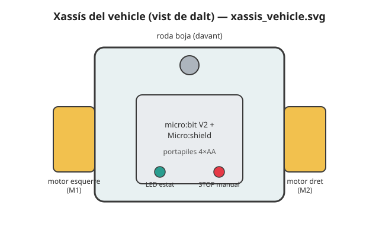

# 🚗 Projecte T2 · El vehicle teledirigit

> **Per a qui és?** Per a **cada alumne**, individualment, durant el 2n trimestre. És el dossier del segon robot del curs: peces, muntatge, cablatge, codi mínim i rúbrica. Els reptes de SA4, SA5 i SA6 hi van sumant capacitats; aquí es veu el conjunt.

**Durada:** 2n trimestre (SA4-SA6) · **Maquinari:** micro:bit V2 + Micro:shield (amb controlador de motors integrat, canals M1/M2), 2 motoreductors + rodes KS9008 (Kit 2), roda boja, Kit 1 (LED, polsador), Kit 3 (relé, DHT11), portapiles 4×AA, xassís de DM 3 mm

## El robot

El vehicle és un xassís de DM 3 mm amb **encaixos tallats a làser**: porta els dos **motoreductors** amb rodes muntats als suports laterals, una **roda boja** al davant o al darrere com a tercer punt de suport i, fixada al centre, la **micro:bit + Micro:shield** amb el **portapiles**. És el primer robot del curs que **es mou de manera controlada a distància**: a **SA4** s'encapsulen els moviments bàsics en funcions pròpies i es munta el xassís; a **SA5** s'hi afegeix el **control remot per ràdio** des d'una altra micro:bit; a **SA6** s'hi integra un **sistema de control amb aturada d'emergència** que interromp qualsevol moviment, sigui quin sigui l'estat en curs.



Què fa: es **mou per funcions pròpies** —`avancar()`, `retrocedir()`, `girar()`, `aturar()`— activades primer amb els botons A/B (SA4) i després per **comandes de ràdio** enviades des d'una altra placa (SA5); i s'**atura sempre que cal**, encara que estigui fent una altra cosa, gràcies a l'estat prioritari **STOP** (SA6).

## Llista de peces

| Peça | Origen | Quantitat |
|---|---|---|
| Xassís de DM 3 mm amb encaixos | Plantilla `xassis_vehicle.svg`, tall làser | 1 planxa |
| Roda boja (per a canica 16 mm) | `roda_boja.scad`, impressió 3D | 1 |
| Suports de motor i d'electrònica | `suport_motor.scad` / `suport_electronica.scad`, impressió 3D | 2 + 1 |
| Canica de 16 mm (roda boja) | Material del centre | 1 |
| Motoreductor + roda KS9008 | Kit 2 | 2 |
| micro:bit V2 + Micro:shield (amb controlador de motors) | Dotació individual | 1 |
| LED indicador d'estat | Kit 1 | 1 |
| Polsador (STOP manual) | Kit 1 | 1 |
| Relé + DHT11 *(termòstat, ampliació SA6)* | Kit 3 | 1 + 1 |
| Portapiles 4×AA | Material del centre | 1 |
| Cargols M3 | Material del centre | segons muntatge |

<!-- web:only-github -->
Plantilla de tall làser: [`../../Recursos/plantilles_laser/xassis_vehicle.svg`](../../Recursos/plantilles_laser/xassis_vehicle.svg).
Peces impreses en 3D: [`../../Recursos/peces_3d/roda_boja.scad`](../../Recursos/peces_3d/roda_boja.scad),
[`../../Recursos/peces_3d/suport_motor.scad`](../../Recursos/peces_3d/suport_motor.scad).
<!-- /web:only-github -->

## Fabricació i personalització

El xassís és **fix** (línies de tall i encaixos calibrats): ningú el toca. La personalització és el **nom** de l'alumne, gravat en una zona lliure del xassís. Flux i calendari de lots: vegeu [`00_Fil_conductor_construccions.md`](00_Fil_conductor_construccions.md) §3 (nesting per a 15-20 alumnes, tall fora d'horari lectiu).

## Muntatge

1. Encaixa el **xassís** (cos + suports de motor, sense cola).
2. Munta els **dos motoreductors** amb rodes als suports, i la **roda boja** (`roda_boja.scad` + canica) com a tercer punt de suport.
3. Fixa la **micro:bit + Micro:shield** i el **portapiles** al centre, amb els ports accessibles.
4. Munta el **LED indicador** i el **polsador de STOP manual** en un lloc visible i accessible.
5. Cablatge complet segons la taula de baix; comprova-ho **abans** d'alimentar els motors.
6. Test de fum: puja un programa de prova (endavant/enrere amb botons A/B) i comprova que respon abans de donar el muntatge per acabat.

> ⚠️ **GND comú:** si el portapiles, el Micro:shield i els mòduls addicionals no comparteixen la mateixa massa, els motors o les lectures fallen de manera intermitent i difícil de diagnosticar.

## Cablatge (pins del Micro:shield)

> 🔑 **Font única de pins:** aquesta taula reprodueix la fila «T2 · Vehicle» del [«Mapa de pins per trimestre»](00_Fil_conductor_construccions.md#1b-mapa-de-pins-per-trimestre-font-unica-vinculant) de `00_Fil_conductor_construccions.md`, que és el document vinculant (fixat a la SA4). Aquests pins es reutilitzen sense tocar-los a T3 (rover).

| Component | Pin / canal | Notes |
|---|---|---|
| Motoreductor esquerre (M1), sentit endavant | **P13** | PWM (`write_analog`) per avançar aquest motor. |
| Motoreductor esquerre (M1), sentit enrere | **P14** | PWM per recular aquest motor. |
| Motoreductor dret (M2), sentit endavant | **P15** | PWM per avançar aquest motor. |
| Motoreductor dret (M2), sentit enrere | **P16** | PWM per recular aquest motor. |
| LED indicador d'estat | **P1** | Encès fix = RUN, intermitent = ALERTA, apagat = STOP. Reaprofita el pin del LED de la mascota, ja alliberat (vegeu §Transició del mapa de pins). |
| Polsador STOP manual | **P12** | Digital, *pull-up* intern; prioritat màxima al programa. Reaprofita el pin del polsador de la mascota. |
| Relé (termòstat, ampliació SA6) | **P2** | Digital; commuta l'actuador de l'exemple de control amb realimentació. Reaprofita el pin del brunzidor de la mascota. |
| DHT11 (temperatura, ampliació SA6) | **P8** | Bus digital 1-Wire. Reaprofita el pin del PIR de la mascota; **no** P13, ocupat pel motor M1. |
| Ràdio (SA5) | — | Ràdio interna de la micro:bit (`radio`); no necessita cablatge. |

**Alimentació:** portapiles **4×AA** al Micro:shield (motors) · la micro:bit **no s'alimenta per USB quan els motors funcionen** (només per programar-la o depurar-la aturada).

## Control remot per ràdio (SA5) i aturada d'emergència (SA6)

- **Regla de ràdio (treball individual):** cada alumne escriu el **seu propi** codi d'emissor (comandament) i de receptor (vehicle); per verificar-los, s'aparella **puntualment** amb la placa d'un company (grups de ràdio per números de llista, banc de proves) — mai com a producte compartit. Detall complet: `Programació didàctica/14_SA5_Radio_robots_que_parlen.md`.
- **Protocol de comandes propi** (mínim 4): p. ex. `"F"` (endavant), `"B"` (enrere), `"L"`/`"R"` (girar), `"S"` (atura).
- **Aturada d'emergència (SA6):** l'estat **STOP** és **prioritari sobre qualsevol altre**: es dispara amb el **polsador manual del xassís** o amb una **comanda de ràdio** dedicada (p. ex. `"X"`), interromp el moviment en curs a l'instant i encén el LED indicador. Cap altra transició d'estat el pot ignorar.
- **+ Ampliació (no obligatòria, connecta amb el rover de T3):** el Kit 2 inclou un sensor d'ultrasons HC-SR04 que ja s'usa a SA3 i SA7; qui vulgui anar més enllà pot afegir una **aturada automàtica per proximitat** (STOP si `distancia() < llindar`) com a variant del mateix estat prioritari, sense canviar l'estructura de la màquina d'estats.

## 🧗 Si t'encalles: l'esquelet del programa

<details markdown="1">
<summary>Desplega l'esquelet (còpia'l a un fitxer nou)</summary>

```python
# Projecte T2 - El vehicle teledirigit (ESQUELET per comencar)
#
# Estructura: funcions de moviment (SA4), recepcio per radio (SA5) i
# maquina d'estats amb STOP prioritari (SA6). Omple els # TODO.

from microbit import *
import radio

GRUP_RADIO = 10  # el mateix per a comandament i vehicle

RUN, STOP, ALERTA = range(3)
estat = RUN

radio.on()
radio.config(group=GRUP_RADIO)


def avancar(velocitat):
    pass  # TODO: PWM als canals de motor (endavant)


def retrocedir(velocitat):
    pass  # TODO


def girar(costat):
    pass  # TODO: velocitat diferent/oposada a cada roda


def aturar():
    pass  # TODO: velocitat 0 als dos canals


def actualitza_estat(nou):
    global estat
    if nou == STOP:
        aturar()  # EXEMPLE RESOLT: STOP sempre guanya, es processi on es processi
        display.show(Image.NO)
    estat = nou


while True:
    if not pin12.read_digital():  # polsador amb pull-up: LOW = premut
        actualitza_estat(STOP)

    missatge = radio.receive()
    if missatge is not None:
        if missatge == 'X':
            actualitza_estat(STOP)
        elif estat != STOP:
            if missatge == 'F':
                avancar(400)
            # TODO: la resta de comandes del teu protocol (B, L, R, S...)

    sleep(20)
```

</details>

## Què hi aporta cada SA

| SA | Sessions | Què s'hi construeix | Repte relacionat |
|---|---|---|---|
| SA4 | S1-S4 (S4 = fabricació) | Funcions de moviment pròpies i muntatge físic del xassís. | `Reptes_SA4.md` |
| SA5 | S1-S3 | Control remot per ràdio amb protocol de comandes propi. | `Reptes_SA5.md` |
| SA6 | S1-S3 (S4 = Prova T2) | Màquina d'estats amb aturada d'emergència prioritària i integració d'un sensor de realimentació. | `Reptes_SA6.md` |

**Producte final (SA6-S3):** vehicle teledirigit per ràdio amb màquina d'estats i **STOP prioritari** funcionant, amb senyal visual de l'estat. Es tanca a la S3; la S4 de SA6 és la prova pràctica **T2**, individual.

## Rúbrica del robot (producte SA6)

| Criteri | Insuficient (0-4) | Suficient/Bé (5-6) | Notable (7-8) | Excel·lent (9-10) |
|---|---|---|---|---|
| **R2 · Muntatge** | Xassís inestable o cablejat insegur. | Xassís funcional però amb algun cable fluix. | Xassís ferm i cablejat endreçat. | Xassís ferm, cablejat endreçat i etiquetat, res solt. |
| **R1 · Funcionament** | Els motors o la ràdio no responen de manera fiable. | Respon amb errors freqüents. | Respon de manera fiable amb algun ajust. | Respon de manera fiable i fluida a la primera. |
| **R3 · Autonomia/control** | Sense STOP prioritari o l'STOP no interromp res. | STOP funciona però no sempre té prioritat. | STOP prioritari funciona en tots els casos provats. | STOP prioritari + realimentació (relé/DHT11) integrats i justificats. |
| **R4 · Documentació i defensa** | Sense quadern o sense poder explicar el sistema. | Quadern bàsic o defensa amb ajuda. | Quadern complet i defensa a peu de taula (2-3', R4·DO) amb una decisió justificada. | Quadern complet i defensa que justifica decisions i alternatives descartades. |

## Problemes freqüents

| Símptoma | Causa probable | Solució |
|---|---|---|
| Un motor gira al revés | Sentit del canal M1/M2 invertit al cablatge o al codi. | Inverteix el signe de la velocitat del motor afectat al codi (no recablis si no cal). |
| El vehicle no avança recte | PWM desigual entre M1 i M2. | Calibra els valors de cada motor per compensar la diferència. |
| El vehicle no respon a la ràdio | Grup (`group=`) diferent entre comandament i vehicle, o `radio.on()` no cridat. | Comprova que els dos programes tenen el mateix `group` i que la ràdio està activada als dos costats. |
| L'STOP no interromp el moviment | L'estat STOP es comprova només en algun punt del bucle, no a cada volta. | Comprova el polsador **abans** de processar qualsevol altra comanda a cada iteració del `while True:`. |
| La micro:bit es reinicia en moure els motors | Alimentada per USB en lloc del portapiles. | Alimenta el Micro:shield des del portapiles, mai per USB, quan els motors funcionen. |

> **Pla B:** si el vehicle d'un alumne no arriba muntat a temps per a SA5 (fabricació endarrerida), treballa el protocol de ràdio al **simulador** (emissor/receptor sobre el mateix esquema lògic) i acaba el muntatge tan bon punt tingui les peces, sense penalització (vegeu `00_Fil_conductor_construccions.md` §4).

---

⬅️ Torna a: [Reptes de la SA4](../../Reptes/Reptes_SA4.md) · [Reptes de la SA5](../../Reptes/Reptes_SA5.md) · [Reptes de la SA6](../../Reptes/Reptes_SA6.md) · [El fil conductor de les tres construccions](00_Fil_conductor_construccions.md)
