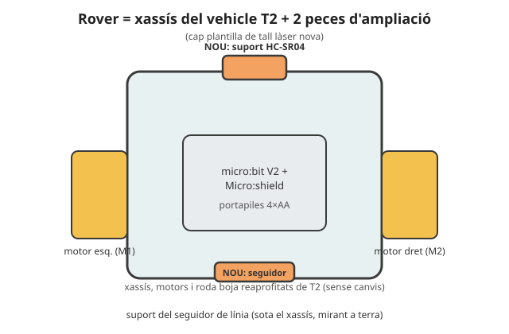

# 🚙 Projecte T3 · El rover autònom

> **Per a qui és?** Per a **cada alumne**, individualment, durant el 3r trimestre. És el dossier del tercer robot del curs: peces, muntatge, cablatge, codi mínim i rúbrica. Es munta abans de començar la SA7 i els reptes de SA7, SA8 i SA9 hi van sumant capacitats.

**Durada:** 3r trimestre (Sessió 0 + SA7-SA9) · **Maquinari:** micro:bit V2 + Micro:shield (controlador de motors integrat), 2 motoreductors + rodes KS9008 (Kit 2), roda boja, seguidor de línia KS0050, sensor d'ultrasons HC-SR04 (Kit 2), IMU MPU6050 + DHT11 + BMP280 + CCS811 (Kit 3, SA8), portapiles 4×AA, xassís de DM 3 mm

## El robot

El rover és l'**evolució** del vehicle de T2: mateix esquema de xassís de dues rodes motoritzades + roda boja, però ara amb **percepció pròpia**: un **seguidor de línia** sota el xassís i un **sensor d'ultrasons** al davant li permeten decidir sol, sense comandament. A **Sessió 0** (prèvia a SA7) cada alumne munta el seu rover a partir de peces pretallades; a **SA7** hi programa comportaments autònoms (seguidor de línia, evita-obstacles); a **SA8** hi afegeix **telemetria per ràdio** cap al seu propi programa d'estació base; a **SA9** l'amplia amb un **repte lliure** individual per al projecte final.



Què fa: a **SA7** decideix sol amb **cinemàtica diferencial** —seguir una línia pintada a terra o evitar un obstacle amb l'HC-SR04—; a **SA8** envia les seves lectures (IMU, temperatura, pressió, CO₂) **per ràdio** cap a una estació base amb el seu propi programa; a **SA9** és la plataforma del **repte final individual** de cada alumne.

## Llista de peces

| Peça | Origen | Quantitat |
|---|---|---|
| Xassís de DM 3 mm amb encaixos de motor | Plantilla `xassis_rover.svg`, tall làser | 1 planxa |
| Roda boja (per a canica 16 mm) | `roda_boja.scad`, impressió 3D | 1 |
| Suport frontal HC-SR04 | `suport_hcsr04.scad`, impressió 3D | 1 |
| Canica de 16 mm | Material del centre | 1 |
| Motoreductor + roda KS9008 | Kit 2 | 2 |
| micro:bit V2 + Micro:shield | Dotació individual | 1 |
| Seguidor de línia KS0050 | Kit 2 | 1 |
| Sensor d'ultrasons HC-SR04 | Kit 2 | 1 |
| IMU MPU6050, DHT11, BMP280, CCS811 *(SA8)* | Kit 3 | 1 de cada |
| Portapiles 4×AA | Material del centre | 1 |
| Cargols M3 | Material del centre | segons muntatge |

<!-- web:only-github -->
Plantilla de tall làser: [`../../Recursos/plantilles_laser/xassis_rover.svg`](../../Recursos/plantilles_laser/xassis_rover.svg)
(alternativa de 2 pisos, pla B: [`../../Recursos/plantilles_laser/rover_2pisos.svg`](../../Recursos/plantilles_laser/rover_2pisos.svg)).
Peces impreses en 3D: [`../../Recursos/peces_3d/roda_boja.scad`](../../Recursos/peces_3d/roda_boja.scad),
[`../../Recursos/peces_3d/suport_hcsr04.scad`](../../Recursos/peces_3d/suport_hcsr04.scad).
<!-- /web:only-github -->

## Fabricació i personalització

El xassís és **fix** (encaixos calibrats); la personalització és el **nom**, gravat en una zona lliure. A diferència de T1/T2, el rover **no** es munta a una sessió d'una SA de 8 h: es munta a la **Sessió 0**, prèvia a la SA7, finançada per la compressió de la SA8 (6→4 h) — vegeu `Programació didàctica/08_Sequenciacio_temporal_anual.md` §«Fil conductor i consum del marge». Calendari de lots i nesting: [`00_Fil_conductor_construccions.md`](00_Fil_conductor_construccions.md) §3.

## Muntatge

1. Encaixa el **xassís** (cos + suports de motor, sense cola).
2. Munta els **dos motoreductors** amb rodes i la **roda boja** (`roda_boja.scad` + canica) darrere.
3. Fixa la **micro:bit + Micro:shield** i el **portapiles** al centre.
4. Munta el **suport de l'HC-SR04** (`suport_hcsr04.scad`) al davant, sensor mirant endavant.
5. Enganxa el **seguidor de línia KS0050** sota el xassís, mirant a terra, centrat.
6. Cablatge complet segons la taula de baix; comprova-ho **abans** d'alimentar els motors.

> ⚠️ **GND comú:** el mateix avís que al vehicle (T2) — piles, Micro:shield i sensors han de compartir massa, o les lectures i els motors fallen de manera intermitent.

## Cablatge (pins del Micro:shield)

| Component | Pin / canal | Notes |
|---|---|---|
| Motoreductor esquerre | M1 | Igual que al vehicle de T2. |
| Motoreductor dret | M2 | Igual que al vehicle de T2. |
| Sensor d'ultrasons HC-SR04, TRIG | P1 | Digital, sortida. |
| Sensor d'ultrasons HC-SR04, ECHO | P2 | Digital, entrada. |
| Seguidor de línia KS0050 | P0 (analògic) | Llindar de detecció a calibrar sobre el circuit real. |
| IMU MPU6050 *(SA8)* | P19/P20 (I2C) | Bus I2C compartit amb altres sensors I2C del kit. |
| DHT11 *(SA8)* | P13 | Bus digital 1-Wire. |
| BMP280, CCS811 *(SA8)* | P19/P20 (I2C) | Mateix bus I2C que l'IMU. |
| Ràdio (SA8, telemetria) | — | Ràdio interna de la micro:bit (`radio`); no necessita cablatge. |

> 🔑 **Continuïtat de pins amb el vehicle (T2):** els canals de motor (M1/M2) **no es tornen a tocar** un cop fixats a la Sessió 0 — és l'avantatge de tenir el rover propi: el bloc de pins es fixa una sola vegada per a tot el trimestre.

## Comportaments autònoms (SA7)

- **Cinemàtica diferencial:** girar variant la velocitat/sentit relatiu de cada roda (les mateixes funcions `avancar()/girar()/aturar()` de T2, adaptades als dos motoreductors del rover).
- **Seguidor de línia:** llegeix el KS0050 i corregeix la trajectòria cap al costat on es perd la línia.
- **Evita-obstacles:** llegeix la distància amb `mesura_distancia()` (HC-SR04) i atura/gira si detecta un obstacle proper.
- El repte **"tria un comportament autònom"** (seguidor de línia i/o evita-obstacles) pot fer de producte de la SA si el calendari ho requereix (pla de contingència, tercera retallada — vegeu doc. 08).

## Telemetria (SA8)

- **Regla de ràdio i estació base (treball individual):** cada alumne escriu igualment el **seu propi** programa d'estació base (és el que s'avalua); l'executa temporalment a la placa d'un **company** (per torns, grups per números de llista) o del **docent**. La placa és només el banc de proves; el codi i la interpretació de les dades són sempre evidència pròpia. Detall complet: `Programació didàctica/17_SA8_Autonomia_i_telemetria.md`.
- **Mínim dos sensors** del Kit 3 (IMU, DHT11, BMP280 o CCS811) enviats per ràdio i registrats/mostrats amb el programa d'estació base propi (llista de lectures + mitjana simple).

## 🧗 Si t'encalles: l'esquelet del programa (evita-obstacles + telemetria bàsica)

<details markdown="1">
<summary>Desplega l'esquelet (còpia'l a un fitxer nou)</summary>

```python
# Projecte T3 - El rover autonom (ESQUELET per comencar)
#
# Comportament base: evita obstacles (SA7) + telemetria per radio (SA8).
# Omple els # TODO.

from microbit import *
import radio

GRUP_RADIO = 10
LLINDAR_OBSTACLE = 15  # cm

radio.on()
radio.config(group=GRUP_RADIO)


def mesura_distancia():
    pass  # TODO: pols TRIG/ECHO de l'HC-SR04 -> distancia en cm


def avancar(velocitat):
    pass  # TODO: PWM als canals M1/M2 (reaprofita el del vehicle T2)


def girar(costat):
    pass  # TODO


def aturar():
    pass  # TODO


def envia_lectura(etiqueta, valor):
    radio.send(etiqueta + ':' + str(valor))  # EXEMPLE RESOLT: format "T:23.5"


while True:
    # EXEMPLE RESOLT: cicle reactiu - llegir a CADA volta, no un sol cop
    dist = mesura_distancia()
    if dist < LLINDAR_OBSTACLE:
        aturar()
        girar('esquerra')
    else:
        avancar(400)

    # TODO (SA8): llegeix un sensor del Kit 3 (temperature(), accelerometer...)
    #      i envia'l amb envia_lectura() cada 2 segons (usa running_time()).

    sleep(20)
```

</details>

## Què hi aporta cada fase

| Fase | Sessions | Què s'hi construeix | Repte relacionat |
|---|---|---|---|
| Sessió 0 | 1 sessió, prèvia a SA7 | Muntatge físic complet del rover (peces pretallades). | Checklist de muntatge (R2, formativa) |
| SA7 | S1-S4 | Cinemàtica diferencial, seguidor de línia i/o evita-obstacles: el rover **és** la plataforma de la SA. | `Reptes_SA7.md` |
| SA8 | S1-S3 | Telemetria per ràdio (IMU, DHT11, BMP280, CCS811) cap al propi programa d'estació base; introducció a la IA aplicada al control. | `Reptes_SA8.md` |
| SA9 | S1-S5 (S5 = Prova T3) | Repte lliure individual + dossier tècnic + defensa oral, amb el mateix rover ampliat. | [`README de la SA9`](../SA9/README.md) |

**Producte final (SA9-S4):** el rover ampliat amb el repte lliure de cada alumne, funcional, més el **dossier tècnic** i la **defensa oral individual**. Es tanca a la S4; la S5 és la prova pràctica **T3**, individual i per estacions rotatives.

## Rúbrica del robot (avaluada dins el producte de SA9, dimensió «Projectes i productes»)

| Criteri | Insuficient (0-4) | Suficient/Bé (5-6) | Notable (7-8) | Excel·lent (9-10) |
|---|---|---|---|---|
| **R2 · Muntatge i robustesa** | El rover no aguanta el repte final (es desmunta o deixa de respondre). | Aguanta amb algun retoc d'última hora. | Aguanta sense retocs, cablatge endreçat. | Aguanta sense retocs, cablatge endreçat i etiquetat, res solt. |
| **R3 · Comportaments autònoms** | No segueix línia ni evita obstacles de manera fiable. | Segueix línia **o** evita obstacles, amb errors freqüents. | Segueix línia **i** evita obstacles, amb algun error puntual. | Comportaments fiables i fluids, més el repte lliure de SA9 integrat. |
| **R1 · Telemetria** | No arriben dades per ràdio a l'estació base. | Arriben dades bàsiques, de manera intermitent. | Arriben dades de manera fiable i es registren. | Telemetria fiable, ben etiquetada i útil per seguir l'estat del rover en directe. |
| **R4 · Documentació tècnica i defensa** | Sense esquema ni codi comentat. | Esquema o codi comentat, no els dos. | Dossier complet (esquema, codi comentat, proves) i defensa clara. | Dossier exhaustiu amb diari de calibratge i defensa que respon preguntes amb criteri. |

## Problemes freqüents

| Símptoma | Causa probable | Solució |
|---|---|---|
| Un motor gira al revés | Sentit del canal M1/M2 invertit (arrossegat del muntatge del vehicle). | Inverteix el signe de la velocitat del motor afectat al codi. |
| El rover no avança recte | PWM desigual entre M1 i M2. | Calibra els valors de cada motor per compensar la diferència. |
| Lectures d'ultrasons erràtiques | GND no comú, o cable massa llarg fins al TRIG/ECHO. | Uneix totes les masses i escurça el cablatge del sensor. |
| No arriba telemetria a l'estació base | Grup de ràdio diferent entre rover i estació base, o `radio.on()` no cridat als dos costats. | Comprova el `group=` i que la ràdio estigui activada a les dues plaques. |
| El seguidor de línia no detecta la línia | Llindar mal calibrat per a la il·luminació real de l'aula. | Recalibra el llindar amb el REPL sobre el circuit de proves real. |

> **Pla B:** si un rover no arriba muntat a temps per a la SA7 (fabricació endarrerida) o no arriba viu a SA9 (avaria), l'alumne passa temporalment al **xassís de reserva** i continua amb el mateix codi canviant només el bloc de pins de motor. Si el disseny d'encaixos no s'adaptés bé, hi ha l'**alternativa de 2 pisos** (`rover_2pisos.svg`) com a pla B de fabricació (vegeu `00_Fil_conductor_construccions.md` §4).

---

⬅️ Torna a: [SA7 (itinerari per sessions)](../SA7/README.md) · [Reptes de la SA7](../../Reptes/Reptes_SA7.md) · [Reptes de la SA8](../../Reptes/Reptes_SA8.md) · [El fil conductor de les tres construccions](00_Fil_conductor_construccions.md)
